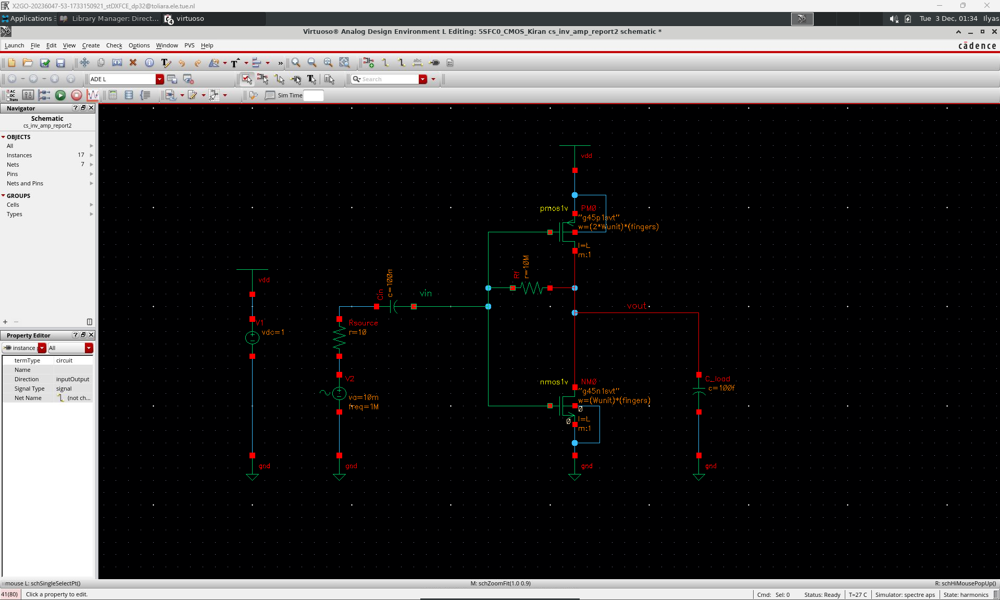
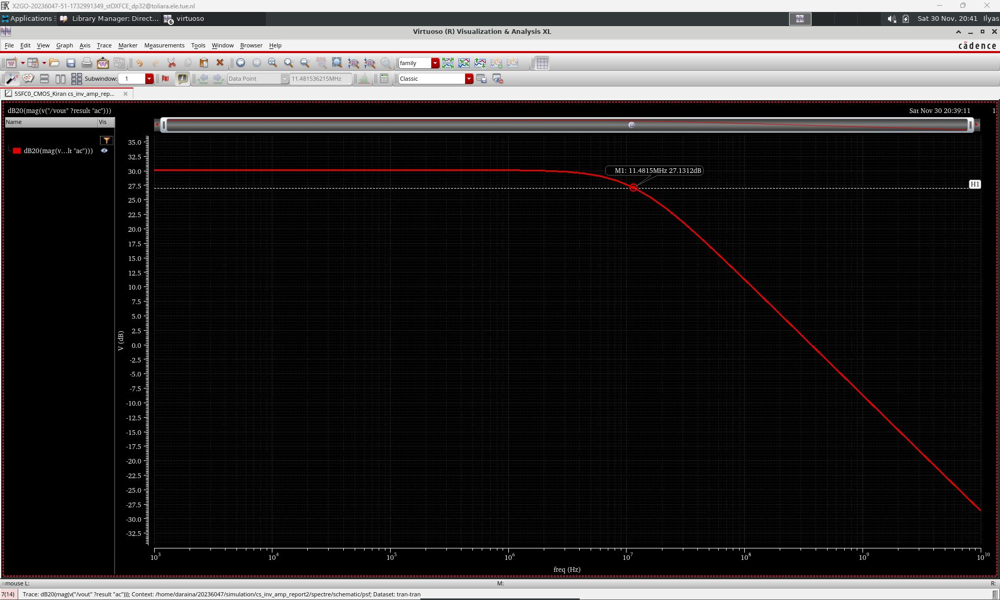
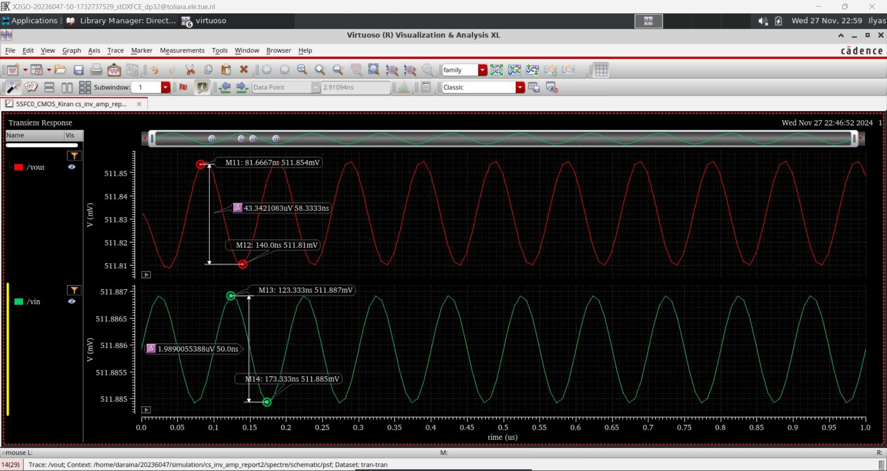
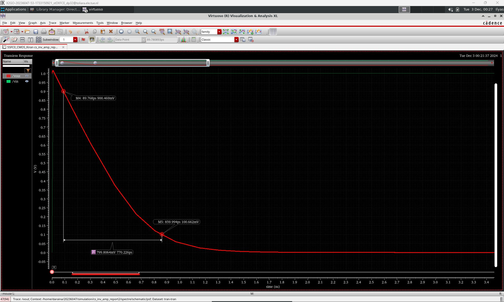
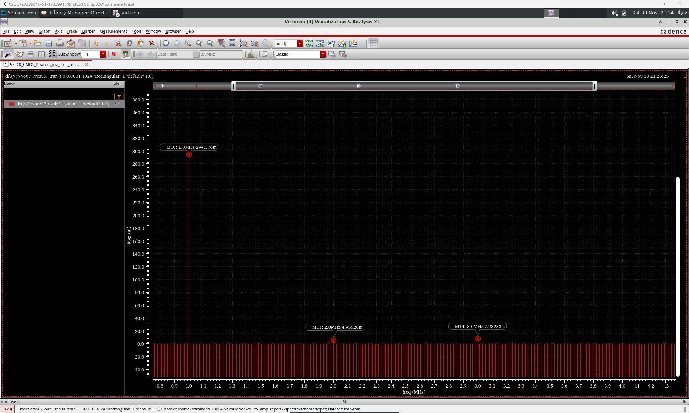

# Analog CMOS Amplifier & OTA Design in Cadence

## Overview
This repository documents a series of analog CMOS circuit design and simulation studies completed as part of the Advanced CMOS Technology coursework during my Engineering Doctorate at Eindhoven University of Technology (TU/e).

The work progresses from a self-biased common-source amplifier to a two-stage current-mirror operational transconductance amplifier (OTA), and finally to a fully differential OTA with common-mode feedback (CMFB). The designs explore transistor-level circuit design, gain and bandwidth optimization, frequency and transient response, stability and compensation, distortion analysis, and PVT performance.

The project was developed using Cadence for circuit design and simulation, with emphasis on understanding the trade-offs between gain, bandwidth, stability, linearity, and power consumption in analog CMOS circuits.

## Design Studies
### 1. Common-Source Amplifier

Designed and simulated a self-biased common-source CMOS amplifier in Cadence Virtuoso. The design focused on achieving the required gain and bandwidth while driving a capacitive load, followed by transient and harmonic characterization of the circuit.

**Design targets:**
- Low-frequency gain ≥ 30 dB
- 3 dB bandwidth ≈ 10 MHz
- Load capacitance: 100 fF
- Source resistance: 10 Ω

**Achieved performance:**
- Low-frequency gain: ≈ 30 dB
- 3 dB bandwidth: ≈ 11.5 MHz
- Slew rate: ≈ 1.04 V/ns

**Additional characterization:**
- Transient response and settling behavior
- Harmonic analysis at 1 MHz
- HD2: ≈ 35.48 dB
- HD3: ≈ 32.13 dB
- SDR: ≈ 30.48 dB
- Noise analysis

#### Circuit Schematic

*Transistor-level implementation of the self-biased common-source amplifier with a PMOS active load and capacitive output load.*

#### Frequency Response

*AC simulation showing approximately 30 dB low-frequency gain and a 3 dB bandwidth of approximately 11.5 MHz.*

#### Transient Response

*Time-domain simulation used to investigate the amplifier response to a sinusoidal input.*

#### Slew-Rate Analysis

*Step-response simulation used to evaluate large-signal settling behavior and determine the slew rate.*

#### Harmonic Analysis

*Frequency-domain analysis of the fundamental and harmonic components used to characterize amplifier linearity.*

### 2. Current-Mirror OTA
### 3. Fully Differential OTA with CMFB

## Design & Simulation Workflow

## Tools & Methods

## Key Results

## Repository Structure

## Academic Context
