# Analog CMOS Amplifier & OTA Design in Cadence

## Overview
This repository documents a series of analog CMOS circuit design and simulation studies completed as part of the Advanced CMOS Technology coursework during my Engineering Doctorate at Eindhoven University of Technology (TU/e).

The work progresses from a self-biased common-source amplifier to a two-stage current-mirror operational transconductance amplifier (OTA), and finally to a fully differential OTA with common-mode feedback (CMFB). The designs explore transistor-level circuit design, gain and bandwidth optimization, frequency and transient response, stability and compensation, distortion analysis, and PVT performance.

The project was developed using Cadence for circuit design and simulation, with emphasis on understanding the trade-offs between gain, bandwidth, stability, linearity, and power consumption in analog CMOS circuits.

## Design Studies
### 1. Common-Source Amplifier

Designed and simulated a self-biased common-source CMOS amplifier in Cadence Virtuoso. The design focused on achieving the required gain and bandwidth while driving a capacitive load, followed by transient and harmonic characterization of the circuit.

**Design targets:**
- Low-frequency gain ≥ 30 dB
- 3 dB bandwidth ≈ 10 MHz
- Load capacitance: 100 fF
- Source resistance: 10 Ω

**Achieved performance:**
- Low-frequency gain: ≈ 30 dB
- 3 dB bandwidth: ≈ 11.5 MHz
- Slew rate: ≈ 1.04 V/ns

**Additional characterization:**
- Transient response and settling behavior
- Harmonic analysis at 1 MHz
- HD2: ≈ 35.48 dB
- HD3: ≈ 32.13 dB
- SDR: ≈ 30.48 dB
- Noise analysis

#### Circuit Schematic

*Transistor-level implementation of the self-biased common-source amplifier with a PMOS active load and capacitive output load.*

The PMOS active load provides a high output resistance to support the required voltage gain, while the feedback path establishes the DC operating point of the amplifier. The circuit was sized and simulated with a 100 fF capacitive load.

#### Frequency Response

*AC simulation showing approximately 30 dB low-frequency gain and a 3 dB bandwidth of approximately 11.5 MHz.*

The simulated low-frequency gain is approximately 30 dB. The response reaches the 3 dB point at approximately 11.5 MHz, satisfying the targeted gain and bandwidth requirements.

#### Transient Response

*Time-domain simulation used to investigate the amplifier response to a sinusoidal input.*

#### Slew-Rate Analysis

*Step-response simulation used to evaluate large-signal settling behavior and determine the slew rate.*

The large-signal step response was used to estimate the output slew rate from the measured voltage transition and corresponding time interval, resulting in approximately 1.04 V/ns.

#### Harmonic Analysis

*Frequency-domain analysis of the fundamental and harmonic components used to characterize amplifier linearity.*

### 2. Current-Mirror OTA

Designed and simulated a two-stage current-mirror operational transconductance amplifier (OTA) in Cadence Virtuoso. The design uses a differential input and single-ended output, with frequency compensation applied to achieve high gain and bandwidth while investigating the stability of the two-stage architecture.

**Design targets:**
- Low-frequency gain > 60 dB
- Unity-gain bandwidth ≥ 500 MHz
- Source resistance: 50 Ω per input path
- Output load capacitance: 10 fF

**Achieved performance:**
- Low-frequency gain: ≈ 60 dB
- Unity-gain bandwidth: ≈ 501 MHz

**Additional characterization:**
- Frequency compensation and stability analysis
- Transient response analysis
- Dual-tone linearity analysis
- SFDR: ≈ 41.68 dB

#### Circuit Schematic

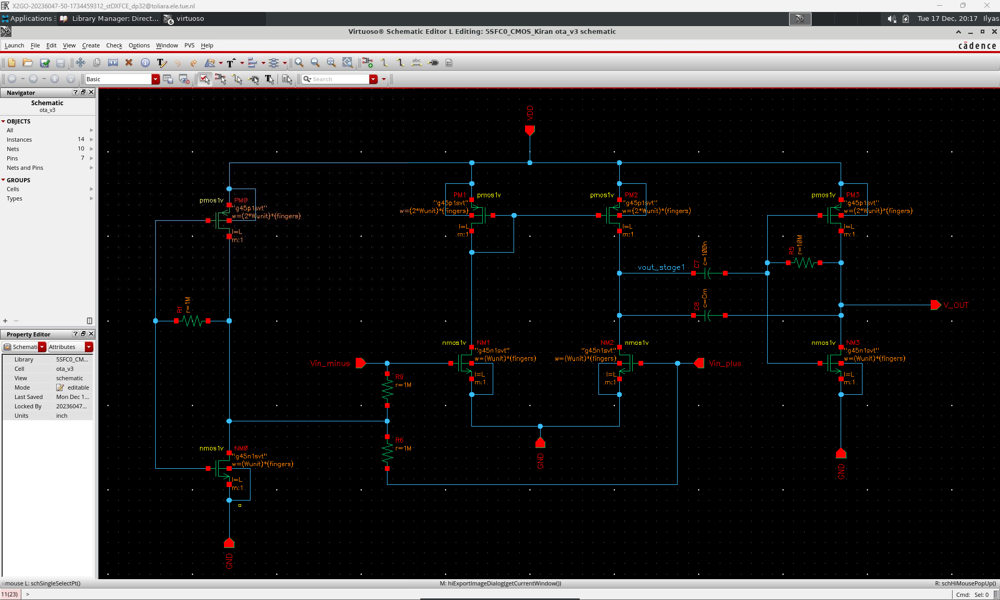

*Transistor-level implementation of the two-stage current-mirror OTA with a differential input stage, single-ended output stage, and frequency-compensation network.*

The two-stage architecture was used to achieve the required high DC gain while extending the output drive capability. Compensation components were introduced between the amplifier stages to shape the frequency response and investigate the gain-bandwidth-stability trade-off.

#### Simulation Testbench

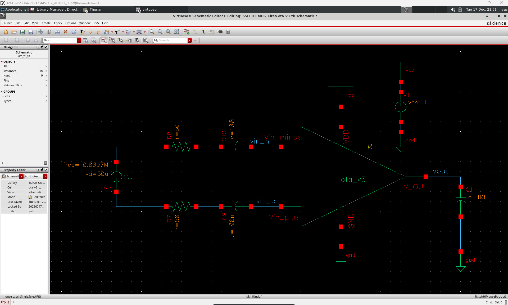

*Cadence testbench used to evaluate the OTA with differential excitation, 50 Ω source resistance, and a 10 fF capacitive output load.*

The OTA was evaluated using a differential input configuration with 50 Ω source resistance on each input path. AC-coupling capacitors isolate the signal source from the OTA input bias conditions, while the 10 fF output capacitance represents the specified load. This testbench was used as the basis for the AC, transient, and linearity simulations.

#### AC Response and Stability

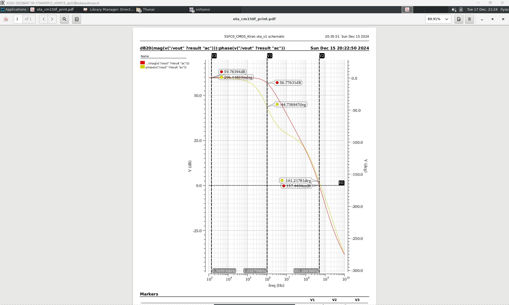

*AC simulation showing the gain magnitude and phase response of the compensated two-stage OTA.*

The simulated response demonstrates approximately 60 dB low-frequency gain and a unity-gain bandwidth of approximately 501 MHz, meeting the principal gain and bandwidth objectives. The phase response was also evaluated during compensation design to assess the stability of the two-stage architecture.

#### Transient Response

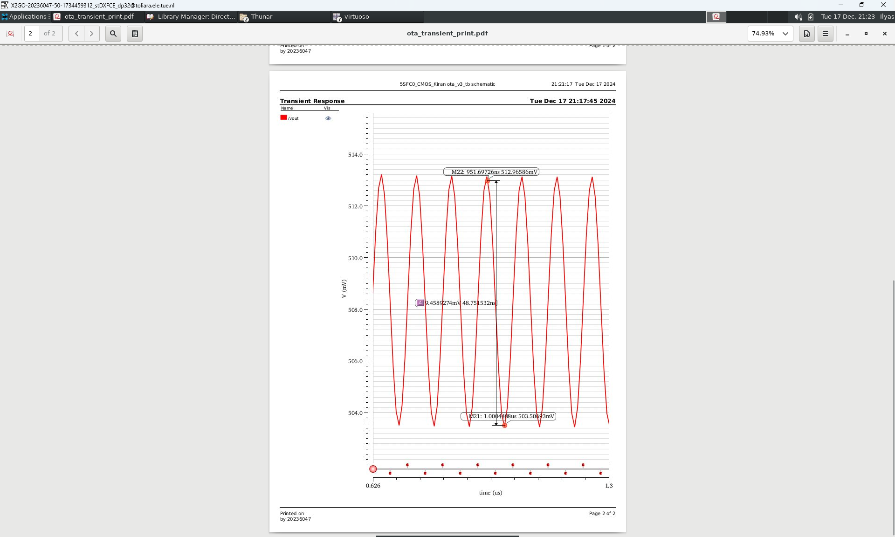

*Time-domain simulation used to evaluate the OTA output response under differential excitation.*

#### Linearity and SFDR Analysis

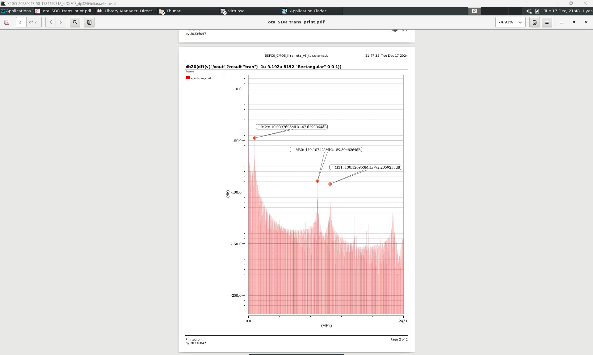

*Frequency-domain analysis used to evaluate the spectral purity and nonlinear distortion of the OTA.*

The fundamental output component is approximately −47.63 dB, while the largest identified distortion component is approximately −89.30 dB, corresponding to an SFDR of approximately **41.68 dB**. This exceeds the additional 40 dB SFDR target used for the linearity study.

### 3. Fully Differential OTA with CMFB

Designed and simulated a fully differential two-stage CMOS OTA with common-mode feedback (CMFB) in Cadence Virtuoso. This design extends the previous OTA study to a fully differential architecture, incorporating input common-mode biasing, output common-mode regulation, Miller RC compensation, and PVT verification.

**Design targets:**
- Fully differential input and output
- Low-frequency differential gain > 40 dB
- Unity-gain bandwidth ≥ 0.1 GHz
- Tunable output common-mode range ≥ 50 mV
- AC-coupled differential input
- Common-mode feedback for output stabilization
- Supply-voltage and temperature verification

**Achieved performance:**
- Differential gain: ≈ 56.5 dB
- Unity-gain bandwidth: ≈ 450 MHz
- Phase margin: ≈ 40°
- Output common-mode tuning range: ≈ 0.40–0.75 V
- Nominal power consumption: ≈ 0.80 mW

**Additional characterization:**
- Miller RC compensation and stability analysis
- Differential transient-response analysis
- Output-spectrum and linearity analysis
- PVT analysis across process, supply voltage, and temperature
- Power-consumption analysis across PVT conditions

#### Circuit Schematic

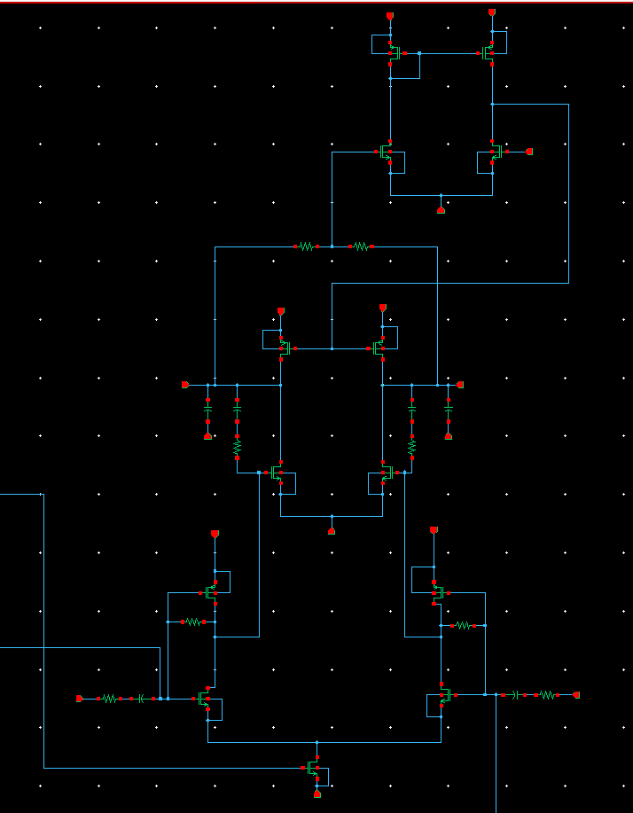

*Transistor-level implementation of the fully differential two-stage OTA with common-mode feedback and frequency compensation.*

The first stage uses a differential NMOS architecture with a tail-current source, while the second stage provides the fully differential outputs. Miller RC compensation is applied between the stages to shape the frequency response and improve stability.

The CMFB network senses the output common-mode level and adjusts the second-stage bias to regulate the outputs around the selected common-mode reference. The implemented output common-mode reference can be tuned from approximately 0.40 V to 0.75 V.

#### Simulation Testbench

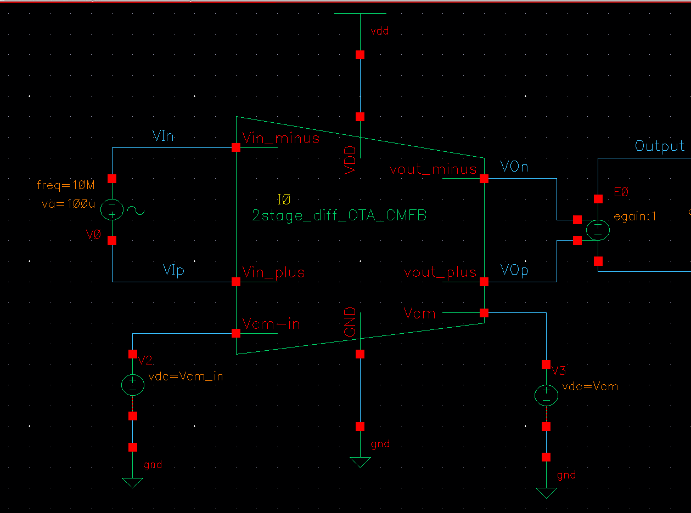

*Cadence testbench used to apply differential excitation, establish the input and output common-mode levels, and evaluate the differential output response.*

The differential input is AC coupled so that signal excitation can be applied independently of the DC input common-mode bias. Separate common-mode references establish the input operating point and desired output common-mode level. The testbench provides the basis for the nominal AC, transient, linearity, and PVT analyses.

#### Differential AC Response

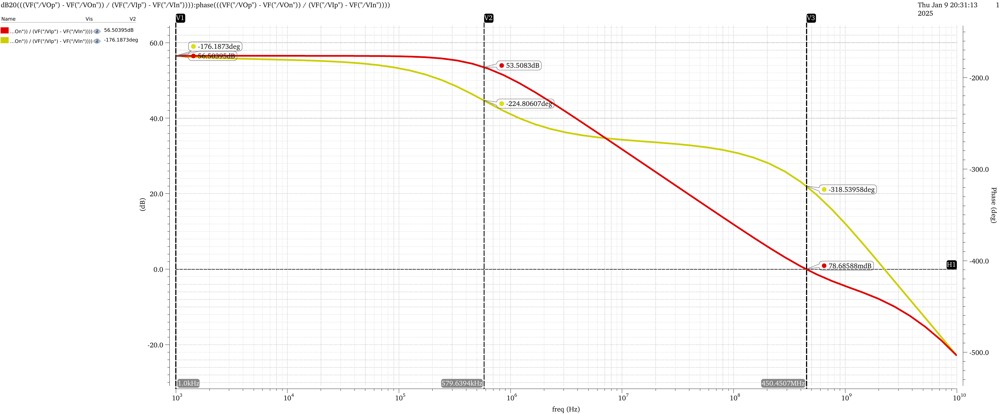

*Nominal differential gain and phase response of the fully differential OTA.*

The differential voltage gain was evaluated as:

`Ad = (Vout+ − Vout−) / (Vin+ − Vin−)`

The nominal simulation achieves approximately **56.5 dB differential gain** and a unity-gain bandwidth of approximately **450 MHz**, exceeding the required 40 dB gain and 0.1 GHz bandwidth targets. Miller RC compensation was used to obtain a nominal phase margin of approximately **40°**.

#### Differential Transient Response

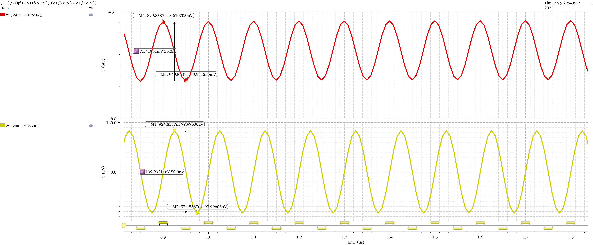

*Time-domain response showing the differential input and corresponding differential output of the OTA.*

The transient simulation evaluates the amplifier directly in differential form using `Vin+ − Vin−` and `Vout+ − Vout−`. The displayed markers correspond to approximately **200 µV peak-to-peak differential input** and approximately **7.54 mV peak-to-peak differential output**, demonstrating the time-domain differential amplification of the circuit.

#### Output Spectrum and Linearity

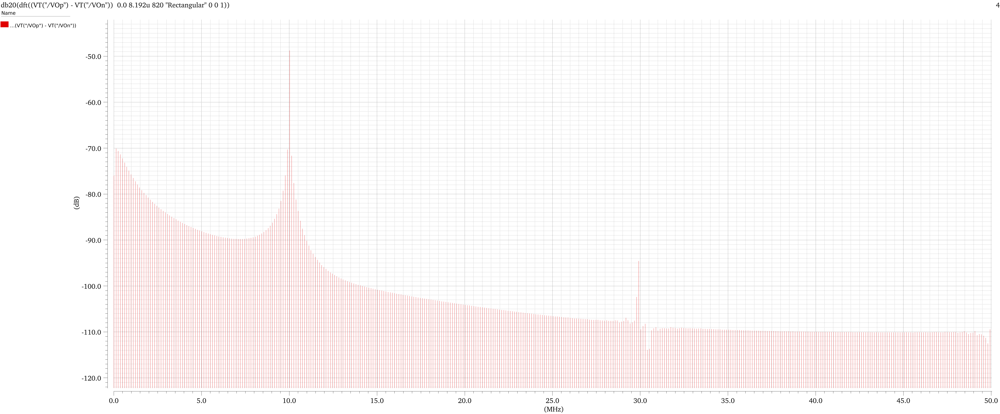

*Frequency-domain spectrum of the differential output used to investigate the linearity of the OTA.*

The spectrum was calculated from the differential output `Vout+ − Vout−`. The dominant component appears at approximately **10 MHz**, with substantially smaller higher-order spectral components. This analysis was used to characterize nonlinear distortion and spectral purity of the fully differential architecture.

#### PVT Gain Analysis

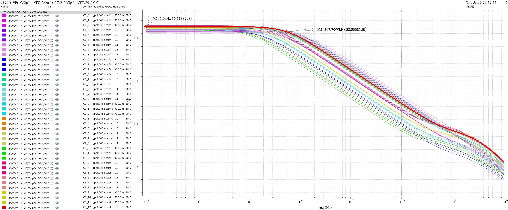

*Differential gain and frequency-response variation across process, supply-voltage, and temperature conditions.*

The OTA was evaluated across process corners, supply voltages of **0.9 V, 1.0 V, and 1.1 V**, and temperatures of **30°C, 60°C, and 90°C**. The sweep demonstrates how operating conditions influence the gain and bandwidth of the fully differential design.

#### PVT Stability Analysis

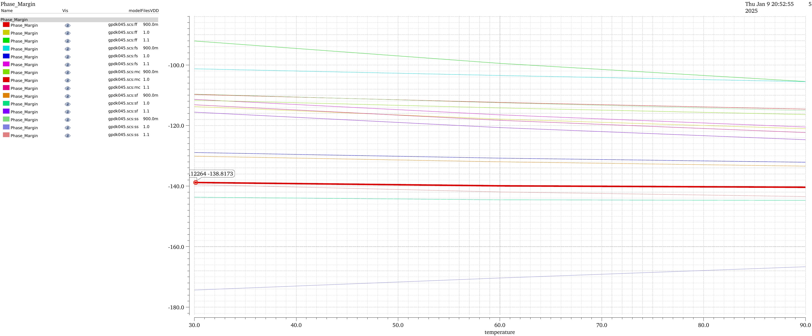

*Stability behavior of the compensated fully differential OTA across the PVT sweep.*

The phase-margin behavior was evaluated across process, voltage, and temperature variations to assess the robustness of the Miller-compensated two-stage architecture beyond the nominal operating condition.

#### Power Consumption Across PVT

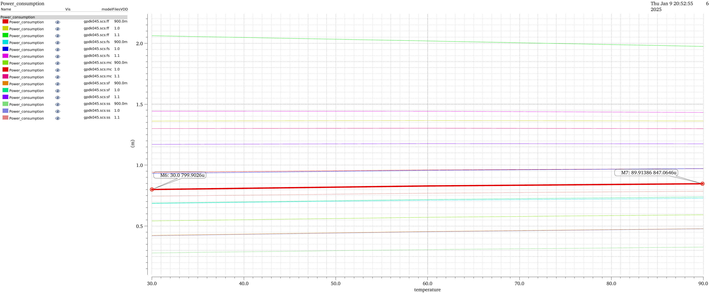

*Power-consumption variation across process corners, supply-voltage levels, and temperature.*

The nominal design consumes approximately **0.80 mW**. Across the complete PVT sweep, power consumption varies with process, supply voltage, and temperature, illustrating the trade-off between analog performance and power efficiency under non-nominal operating conditions.

## Design & Simulation Workflow

## Tools & Methods

## Key Results

## Repository Structure

## Academic Context
